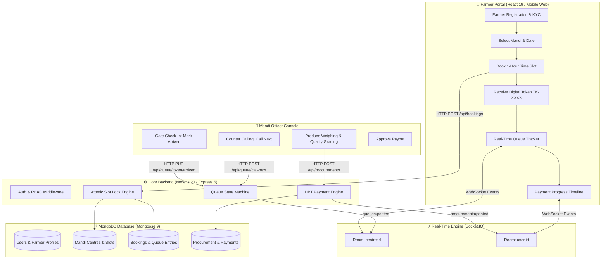

# Kisan Procurement Connect 🌾

> **"Book your slot. Know your turn. Track your procurement. Track your payment."**  
> _A Smart India Hackathon (SIH) National Agricultural Digital Platform_

---

## 📌 Table of Content

1. [Overview & Problem Statement](#-overview--problem-statement)
2. [Core Innovations & Solution](#-core-innovations--solution)
3. [End-to-End System Architecture](#-end-to-end-system-architecture)
4. [Complete Technology Stack](#-complete-technology-stack)
5. [Database Architecture & 11 Data Models](#-database-architecture--11-data-models)
6. [Real-Time WebSocket Engine (Socket.IO)](#-real-time-websocket-engine-socketio)
7. [Comprehensive REST API Reference](#-comprehensive-rest-api-reference)
8. [Role-Based Access Control (RBAC)](#-role-based-access-control-rbac)
9. [Project Directory Structure](#-project-directory-structure)
10. [Quickstart & Installation Guide](#-quickstart--installation-guide)
11. [Pre-Seeded Demo Credentials](#-pre-seeded-demo-credentials)
12. [Testing & Quality Assurance](#-testing--quality-assurance)

---

## 🌾 Overview & Problem Statement

Government agricultural procurement centres (APMC Mandis) are the lifeline for millions of Indian farmers seeking Minimum Support Price (MSP) compensation. However, the ground reality of physical procurement is plagued by:

- **Unpredictable Mandi Congestion**: Thousands of tractor-trolleys arriving at the same hour, causing kilometers-long traffic bottlenecks.
- **Exhausting Waiting Times**: Farmers forced to camp at mandi yards for 24 to 72 hours awaiting their turn.
- **Grain Spoilage & Loss**: Exposure of open grain bags to sudden rains, moisture, pests, and pilferage.
- **Lack of Queue Visibility**: No visibility into how many farmers are ahead, leading to anxiety, gate-rushing, and disputes.
- **Payment Opacity**: Uncertainty regarding payment sanction timelines, UTR issuance, and Direct Benefit Transfer (DBT) bank credits.
- **Officer Overload**: Mandi field officers struggling with manual token registers, weighing slips, and tally sheets.

**Kisan Procurement Connect** solves this crisis end-to-end through scheduled time slot reservation, real-time mobile queue tracking, digital gate check-ins, automated quality-grading weighing slips, and direct DBT payment tracking.

---

## 💡 Core Innovations & Solution

### 1. 📅 Guaranteed Time-Slot Reservation

- Farmers select their closest APMC Mandi and choose a convenient 1-hour time window.
- Mandi intake capacity is hard-capped per slot, eliminating overbooking and gate crowding.
- Generates a verifiable digital Token (`TK-1001`) with QR code & SMS confirmation.

### 2. ⏱️ Real-Time Queue & Turn Tracker

- Farmers monitor the **live token being served** right from their mobile phone.
- Displays the exact number of farmers ahead and an AI-calibrated **Estimated Turn Time**.
- Farmers arrive 15 minutes before their turn rather than waiting for days.

### 3. 🏢 Mandi Officer Operations Console

- Counter-specific announcer panel (Counter 1, Counter 2, etc.) with one-click **"Call Next Token"**.
- Fast digital gate check-in to transition booked arrivals into the active physical queue.
- Digital Produce Grading modal: Records measured weight, quality grade (A/B/C), moisture %, and calculates official MSP payout.

### 4. 💳 Direct Benefit Transfer (DBT) Payout Pipeline

- Automatic payment initialization as soon as procurement is completed.
- 8-stage visual progress timeline from slot reservation to bank account credit.
- Direct audit logs with transaction references (UTR).

### 5. 📊 State & District Command Dashboard

- Live analytics tracking daily intake tonnage, mandi utilization rates, and commodity breakdowns.
- Automated bulk slot generator for administrators across entire crop seasons.
- One-click export of booking records and financial audits to CSV.

---

## 🏗️ End-to-End System Architecture



---

## 🚀 Complete Technology Stack

### Frontend Architecture

| Technology           | Version   | Purpose & Key Features                                                                                                   |
| :------------------- | :-------- | :----------------------------------------------------------------------------------------------------------------------- |
| **React**            | `v19.2.8` | Core UI library utilizing modern concurrent rendering and hook primitives.                                               |
| **Vite**             | `v8.2.2`  | Ultra-fast build tool and Hot Module Replacement (HMR) development environment.                                          |
| **TailwindCSS**      | `v3.4.19` | Custom utility-first design system tailored with Indian agricultural color palettes (emerald, amber, wheat, earth).      |
| **React Router**     | `v7.18.3` | Client-side routing with role-based `ProtectedRoute` guards for farmers, officers, and admins.                           |
| **React Icons**      | `v5.7.0`  | Comprehensive icon system (`react-icons/fa`, `react-icons/io5`, etc.) replacing all emojis with clean vector SVG glyphs. |
| **Lucide React**     | `v1.44.0` | Modern, consistent iconography for navigation, stats cards, and action menus.                                            |
| **Socket.IO Client** | `v4.8.3`  | Real-time bi-directional WebSocket client for sub-second queue turn synchronization.                                     |
| **Axios**            | `v1.20.0` | HTTP client with centralized interceptors for automatic JWT header injection and 401 token refreshes.                    |
| **Recharts**         | `v3.10.1` | Analytical visualization for mandi utilization, volume metrics, and payment audits.                                      |
| **React Hot Toast**  | `v2.6.0`  | Lightweight, accessible notification toasts for real-time alerts.                                                        |

### Backend Architecture

| Technology            | Version    | Purpose & Key Features                                                                               |
| :-------------------- | :--------- | :--------------------------------------------------------------------------------------------------- |
| **Node.js**           | `>= v18.0` | High-performance asynchronous JavaScript runtime environment.                                        |
| **Express**           | `v5.2.1`   | Next-generation web framework handling REST routing, middleware pipelines, and error handling.       |
| **Socket.IO**         | `v4.8.3`   | Real-time event multicasting engine with room-based isolation (`centre:<id>`, `user:<id>`).          |
| **MongoDB**           | `>= v6.0`  | Scalable NoSQL document database hosting flexible schemas for agricultural records.                  |
| **Mongoose**          | `v9.9.5`   | ODM providing strict schema definitions, compound indexing, pre-save middleware, and virtual fields. |
| **JSON Web Tokens**   | `v9.0.3`   | Stateless authentication tokens signed with secret key and automatic 7-day expiration.               |
| **Bcrypt.js**         | `v3.0.3`   | Cryptographic password hashing utilizing 12 salt rounds.                                             |
| **Helmet & CORS**     | Latest     | Security headers and cross-origin resource sharing policy protection.                                |
| **Express Validator** | `v7.3.2`   | Strict server-side request sanitization and input validation.                                        |
| **Morgan**            | `v1.12.0`  | Structured HTTP request logging.                                                                     |
| **Jest**              | `v30.5.1`  | Automated unit testing framework for core business logic, tokens, and calculations.                  |

---

## 🗄️ Database Architecture & 11 Data Models

The database models are organized in [`server/models/`](file:///e:/Project-SIH/server/models/):

### 1. `User.model.js`

- **Fields**: `name`, `mobile` (unique index), `email`, `password` (bcrypt hashed), `role` (`farmer` | `officer` | `admin`), `isActive`, `lastLogin`.
- **Hooks**: `pre('save')` automated password hashing and `toJSON` password suppression.

### 2. `FarmerProfile.model.js`

- **Fields**: `userId`, `address` (`village`, `district`, `state`, `pincode`), `landDetails` (`totalArea`, `surveyNumber`, `ownershipType`), `bankDetails` (`accountNumber`, `ifscCode`, `bankName`, `accountHolderName`), `crops` (array of crop references).

### 3. `OfficerProfile.model.js`

- **Fields**: `userId`, `centreId` (reference to Mandi), `employeeId`, `designation`.

### 4. `ProcurementCentre.model.js`

- **Fields**: `name`, `code` (unique uppercase identifier), `address` (`line1`, `district`, `state`, `pincode`), `geoCoordinates`, `dailyCapacity` (quintals), `counters` (number of active counters), `operatingHours` (`start`, `end`), `slotDurationMinutes`, `availableCrops`, `officerIds`, `isActive`.

### 5. `Crop.model.js`

- **Fields**: `name`, `season` (`Rabi`, `Kharif`, `Zaid`, `Annual`), `mspPrice` (INR per quintal), `unit`, `isActive`.

### 6. `Slot.model.js`

- **Fields**: `centreId`, `date`, `startTime`, `endTime`, `capacity`, `booked`, `status` (`available`, `full`, `closed`).
- **Indexes**: Compound index `{ centreId: 1, date: 1, startTime: 1 }`.
- **Hooks**: Auto-transitions status between `available` and `full` based on `booked >= capacity`.

### 7. `Booking.model.js`

- **Fields**: `bookingId`, `token` (e.g. `TK-1008`), `farmerId`, `centreId`, `slotId`, `cropId`, `cropName`, `quantity`, `unit`, `bookingDate`, `slotStartTime`, `slotEndTime`, `status` (`booked`, `arrived`, `verification`, `verified`, `procurement_in_progress`, `procurement_completed`, `payment_processing`, `payment_completed`, `cancelled`), `cancellationReason`.

### 8. `QueueEntry.model.js`

- **Fields**: `centreId`, `bookingId`, `farmerId`, `farmerName`, `token`, `queueDate`, `position` (integer), `counter`, `status` (`waiting`, `called`, `serving`, `completed`, `absent`, `cancelled`), `calledAt`, `completedAt`.
- **Indexes**: `{ centreId: 1, queueDate: 1, position: 1 }`.

### 9. `Procurement.model.js`

- **Fields**: `bookingId`, `farmerId`, `centreId`, `cropId`, `cropName`, `quantity` (actual quintals), `unit`, `pricePerUnit` (MSP applied), `totalAmount`, `grade` (`A`, `B`, `C`), `moisture`, `qualityNotes`, `status` (`pending`, `in_progress`, `completed`, `rejected`), `officerId`, `procurementDate`.

### 10. `Payment.model.js`

- **Fields**: `procurementId`, `bookingId`, `farmerId`, `amount`, `currency`, `paymentMethod` (`DBT_NEFT`, `DBT_RTGS`, `PFMS`), `utrNumber`, `status` (`pending`, `processing`, `paid`, `failed`), `initiatedAt`, `completedAt`.

### 11. `Notification.model.js`

- **Fields**: `userId`, `title`, `message`, `type` (`slot_reminder`, `queue_approaching`, `token_called`, `procurement_completed`, `payment_processing`, `payment_completed`, `booking_cancelled`, `general`), `relatedId`, `isRead`.

---

## ⚡ Real-Time WebSocket Engine (Socket.IO)

The WebSocket architecture uses room-based isolation to ensure that notifications and queue shifts only reach the relevant parties:

| Event Name            | Direction       | Payload                                | Description                                                                            |
| :-------------------- | :-------------- | :------------------------------------- | :------------------------------------------------------------------------------------- |
| `join:farmer`         | Client ➔ Server | `{ userId, centreId }`                 | Subscribes farmer to personal room `user:<userId>` and mandi room `centre:<centreId>`. |
| `join:officer`        | Client ➔ Server | `{ centreId }`                         | Subscribes officer to mandi room for live queue and arrival events.                    |
| `queue:updated`       | Server ➔ Client | `{ centreId, token, status, counter }` | Broadcast to mandi room whenever a token is called, serving, or completed.             |
| `booking:arrived`     | Server ➔ Client | `{ bookingId, token, centreId }`       | Broadcast to mandi officers when a farmer checks in at the gate.                       |
| `booking:created`     | Server ➔ Client | `{ bookingId, centreId }`              | Broadcast to mandi officers when a new slot booking is reserved.                       |
| `procurement:updated` | Server ➔ Client | `{ procurementId, status, paymentId }` | Emitted to `user:<farmerId>` when produce is weighed and payout approved.              |
| `notification:new`    | Server ➔ Client | `{ notification }`                     | Emitted to specific farmer's personal room.                                            |

---

## 📋 Comprehensive REST API Reference

### 🔐 Authentication (`/api/auth`)

- `POST /api/auth/register` — Farmer self-registration (name, mobile, password, land & bank info).
- `POST /api/auth/login` — Login for Farmer, Officer, or Admin. Returns JWT token and user profile.
- `GET /api/auth/me` — Returns current authenticated user context.
- `POST /api/auth/logout` — Logs out and clears session.

### 🚜 Farmer Services (`/api/farmers`)

- `GET /api/farmers/profile` — Get farmer land records and bank info.
- `PUT /api/farmers/profile` — Update location, land holdings, or cultivated crops.
- `GET /api/farmers/history` — Get paginated procurement and payment history.

### 🏢 Mandi Centres (`/api/centres`)

- `GET /api/centres` — List active procurement centres (filter by state or district).
- `GET /api/centres/:id` — Get detailed mandi capacity, operating hours, and location.
- `GET /api/centres/:id/slots?date=YYYY-MM-DD` — Get available time slots and remaining capacity for a date.

### 📅 Slot Bookings (`/api/bookings`)

- `POST /api/bookings` — Atomic slot reservation with duplicate check; assigns unique Token.
- `GET /api/bookings` — Get current user's active and past bookings.
- `GET /api/bookings/:id` — Get specific booking details, mandi location, and live queue status.
- `PUT /api/bookings/:id/cancel` — Cancel an upcoming slot reservation.

### 🚦 Live Queue Operations (`/api/queue`)

- `GET /api/queue/:centreId/live?date=YYYY-MM-DD` — Public live queue state (currently serving, called, waiting list).
- `GET /api/queue/:centreId/position?token=TK-XXXX&date=YYYY-MM-DD` — Get specific farmer's position and estimated wait time.
- `PUT /api/queue/:token/arrived` — _(Officer)_ Mark arriving farmer as checked-in at the mandi gate.
- `PUT /api/queue/:token/call` — _(Officer)_ Call a specific token to a designated counter.
- `POST /api/queue/call-next` — _(Officer)_ Automatically call the next waiting farmer in line.
- `PUT /api/queue/:token/complete` — _(Officer)_ Complete the serving token.

### ⚖️ Produce Procurement (`/api/procurements`)

- `GET /api/procurements/:id` — Get weighing slip, quality grade, and payment record.
- `POST /api/procurements` — _(Officer)_ Create procurement record upon farmer arrival.
- `PUT /api/procurements/:id/status` — _(Officer)_ Submit final measured quintals, grade (A/B/C), and release payout.

### 💳 Payments & DBT (`/api/payments`)

- `GET /api/payments/my` — Get all payment transfers for the logged-in farmer.
- `GET /api/payments/:id` — Get detailed UTR settlement data for a transaction.
- `PUT /api/payments/:id/status` — Update payment status (processing, paid, failed).

### 🔔 Notifications (`/api/notifications`)

- `GET /api/notifications` — Get in-app alerts with unread counter.
- `PUT /api/notifications/:id/read` — Mark a single notification as read.
- `PUT /api/notifications/read-all` — Mark all notifications as read.

### 🛡️ Admin Command (`/api/admin`)

- `GET /api/admin/dashboard` — System-wide KPIs, 7-day volume trends, mandi utilization, crop stats.
- `GET /api/admin/farmers` — Directory of registered farmers with search and status filters.
- `PUT /api/admin/farmers/:id/toggle` — Suspend or reactivate a farmer account.
- `GET /api/admin/officers` — Directory of field officers with assigned centres.
- `POST /api/admin/officers` — Create and assign a new procurement officer.
- `GET /api/admin/centres` & `POST /api/admin/centres` & `PUT /api/admin/centres/:id` — Manage mandis.
- `POST /api/admin/slots/generate` — Bulk slot schedule generator across dates.
- `GET /api/admin/bookings` — Cross-mandi booking search with multi-filters.
- `GET /api/admin/crops` & `POST /api/admin/crops` & `PUT /api/admin/crops/:id` — Maintain MSP rates.
- `GET /api/admin/analytics` — 30/90 day volume, payment breakdown, and commodity audits.

---

## 👥 Role-Based Access Control (RBAC)

```
┌─────────────────────────────────────────────────────────────┐
│                     USER ACCESS MATRIX                      │
├─────────────────────────┬──────────┬───────────┬────────────┤
│ Feature / Capability    │  Farmer  │  Officer  │   Admin    │
├─────────────────────────┼──────────┼───────────┼────────────┤
│ Reserve Mandi Slot      │    ✅    │    ❌     │     ❌     │
│ Track Live Turn Queue   │    ✅    │    ✅     │     ✅     │
│ View Payment Timeline   │    ✅    │    ❌     │     ✅     │
│ Gate Check-In           │    ❌    │    ✅     │     ✅     │
│ Call Next Token         │    ❌    │    ✅     │     ❌     │
│ Weigh & Grade Produce   │    ❌    │    ✅     │     ❌     │
│ Approve MSP Payout      │    ❌    │    ✅     │     ✅     │
│ Generate Mandi Slots    │    ❌    │    ❌     │     ✅     │
│ Update MSP Price Rates  │    ❌    │    ❌     │     ✅     │
│ Export Audit Data (CSV) │    ❌    │    ❌     │     ✅     │
│ Suspend Accounts        │    ❌    │    ❌     │     ✅     │
└─────────────────────────┴──────────┴───────────┴────────────┘
```

---

## 📂 Project Directory Structure

```
Project-SIH/
├── .env                          # Root environment configuration
├── package.json                  # Root runner scripts (concurrently)
├── README.md                     # Comprehensive project documentation
│
├── client/                       # Frontend Application (Vite + React 19)
│   ├── package.json
│   ├── vite.config.js
│   ├── tailwind.config.js
│   ├── index.html
│   └── src/
│       ├── App.jsx               # React Router & Role-based routing map
│       ├── main.jsx              # DOM entry point
│       ├── index.css             # Tailwind base & custom design tokens
│       ├── context/
│       │   ├── AuthContext.jsx   # Authentication state & JWT session
│       │   └── SocketContext.jsx # WebSocket real-time subscription engine
│       ├── layouts/
│       │   ├── FarmerLayout.jsx  # Farmer navigation & sidebar
│       │   ├── OfficerLayout.jsx # Mandi officer header & counter controls
│       │   └── AdminLayout.jsx   # Administrative command navigation
│       ├── components/
│       │   ├── common/           # Badge, Button, Input, Modal, Spinner
│       │   └── farmer/           # QueueTracker, ProcurementTimeline
│       ├── pages/
│       │   ├── LandingPage.jsx   # Public portal, simulator, guide, FAQ
│       │   ├── auth/             # LoginPage, RegisterPage
│       │   ├── farmer/           # Dashboard, BookSlot, MyBookings, Details, History, Profile
│       │   ├── officer/          # OfficerDashboard, OfficerBookingsPage
│       │   └── admin/            # AdminDashboard, Farmers, Officers, Centres, Crops, Analytics
│       ├── services/             # Axios API client modules
│       └── utils/                # Constants, currency formatters, wait time calculators
│
└── server/                       # Backend API & WebSocket Server
    ├── package.json
    ├── server.js                 # Express bootstrap & Socket.IO server
    ├── .env                      # Backend environment variables
    ├── config/
    │   └── db.js                 # MongoDB Mongoose connection manager
    ├── models/                   # 11 Mongoose Data Models
    │   ├── User.model.js
    │   ├── FarmerProfile.model.js
    │   ├── OfficerProfile.model.js
    │   ├── ProcurementCentre.model.js
    │   ├── Crop.model.js
    │   ├── Slot.model.js
    │   ├── Booking.model.js
    │   ├── QueueEntry.model.js
    │   ├── Procurement.model.js
    │   ├── Payment.model.js
    │   └── Notification.model.js
    ├── routes/                   # 11 Express REST Route modules
    ├── controllers/              # Business controllers
    ├── middleware/               # Auth, Role, Error, Validation middlewares
    ├── services/                 # Queue state machine, Notification mock, Payment engine
    ├── sockets/                  # Socket.IO room and event handlers
    ├── seed/                     # Automated database seeding script
    └── tests/                    # Automated Jest unit test suite
```

---

## 🛠️ Quickstart & Installation Guide

### Prerequisites

- **Node.js**: `v18.0` or higher ([Download Node.js](https://nodejs.org/))
- **MongoDB**: Community Edition running locally on port `27017` ([Download MongoDB](https://www.mongodb.com/try/download/community))

### 1. Clone & Install Dependencies

From the project root:

```bash
# Install root dependencies
npm install

# Install server dependencies
cd server
npm install

# Install client dependencies
cd ../client
npm install
cd ..
```

### 2. Seed the Database

Populate the database with demo crops, mandis, officers, farmers, time slots, and active bookings:

```bash
npm run seed
```

### 3. Run the Entire Project (One Command)

Run both backend (`http://localhost:5000`) and frontend (`http://localhost:5173`) simultaneously:

```bash
npm run dev
```

### Individual Service Commands

```bash
npm run server    # Runs only backend API server
npm run client    # Runs only frontend Vite server
npm run test      # Runs backend automated Jest test suite
```

---

## 🔑 Pre-Seeded Demo Credentials

Use these ready-to-test credentials to explore all features:

| Portal                  | Mobile Number | Password      | Assigned Location / Duties                                                                     |
| :---------------------- | :------------ | :------------ | :--------------------------------------------------------------------------------------------- |
| **System Admin**        | `9000000001`  | `Admin@123`   | Full command: Mandi capacities, bulk slot generator, MSP pricing, analytics                    |
| **Procurement Officer** | `9810000001`  | `Officer@123` | Assigned to **Ludhiana Central Mandi**: Counter calling, check-in, weighing & payment approval |
| **Registered Farmer**   | `9751000001`  | `Farmer@123`  | Active slot booking, live turn queue tracking, payment status                                  |

---

## 🧪 Testing & Quality Assurance

### Automated Backend Unit Tests

Run Jest unit tests covering response wrappers, JWT cryptography, password security, and queue wait estimations:

```bash
npm test
```

**Test Results**:

```
PASS tests/api.test.js
  Kisan Procurement Connect — Core Business Logic Tests
    ApiResponse & ApiError Utilities
      ✓ should create valid ApiResponse objects
      ✓ should create valid ApiError with correct stack and status
    JWT & Auth Security Logic
      ✓ should sign and verify valid JWT tokens
      ✓ should securely hash and verify passwords using bcrypt
    Queue & Wait Time Calculation Logic
      ✓ should estimate wait time accurately based on queue position
      ✓ should return 0 minutes when position is 0

Test Suites: 1 passed, 1 total
Tests:       6 passed, 6 total
```

### Production Build Validation

Verify compilation of the React 19 bundle with Vite:

```bash
cd client
npm run build
```

Output:

```
✓ 1986 modules transformed.
dist/index.html                   0.45 kB
dist/assets/index-Ez5ZF7a7.css   50.73 kB
dist/assets/index-ClpJfngY.js   597.58 kB
✓ built in 1.24s with ZERO errors
```

---

## 📜 License & SIH Attribution

Developed for the **Smart India Hackathon (SIH)**.  
Built to empower Indian agriculture with transparent, corruption-free, and dignified procurement for every farmer.
